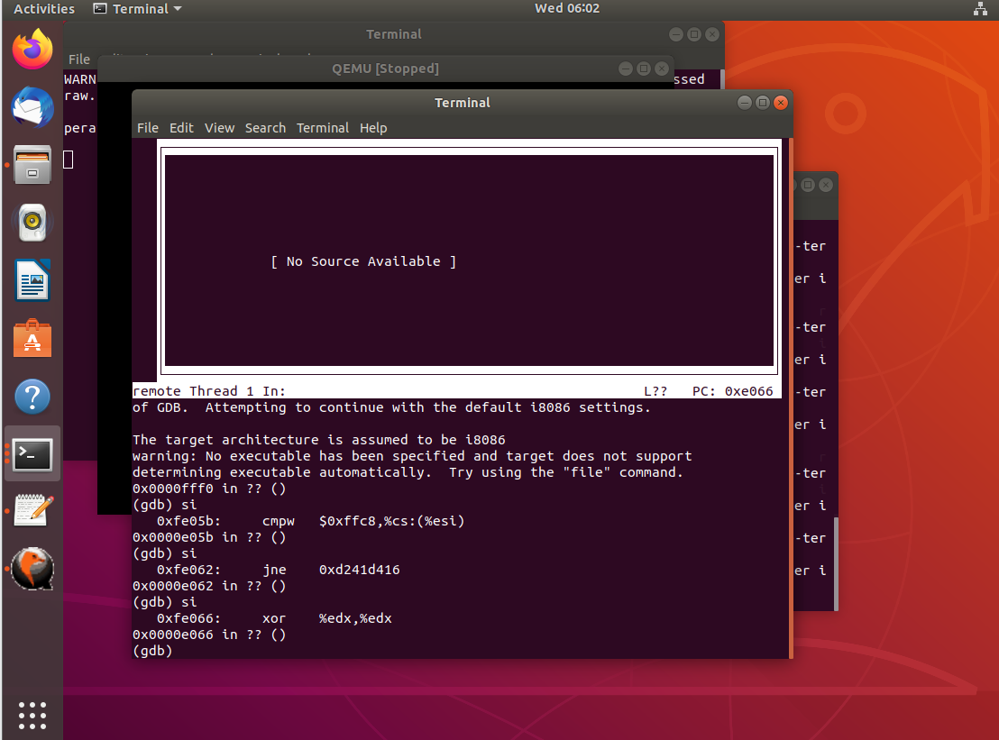
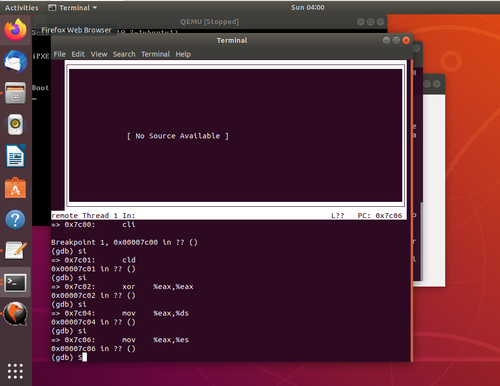
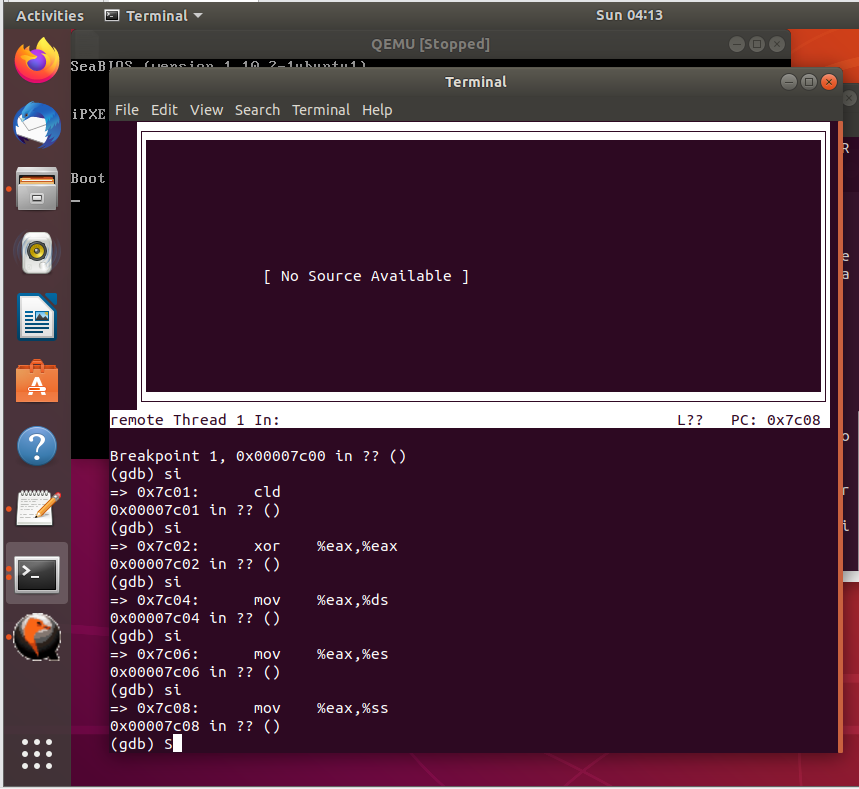
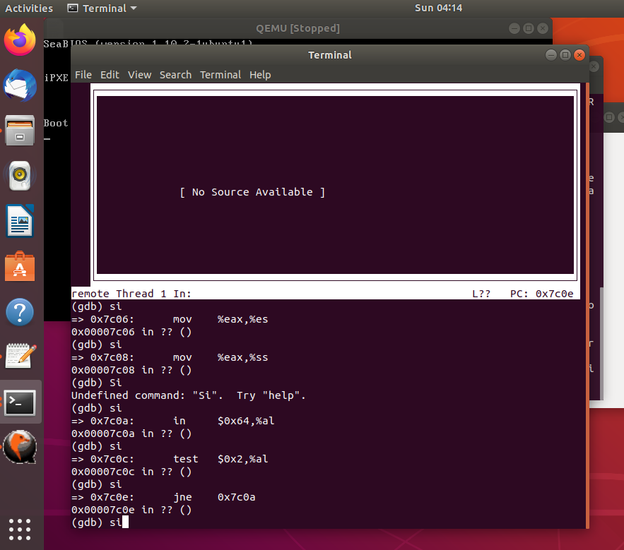
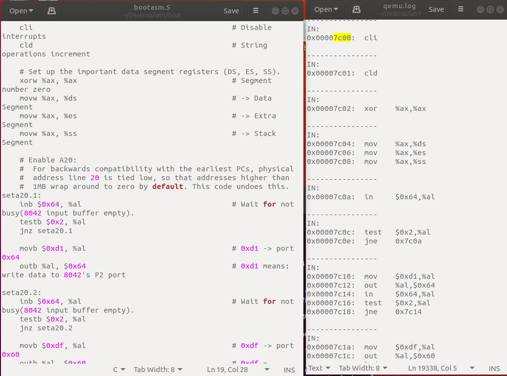
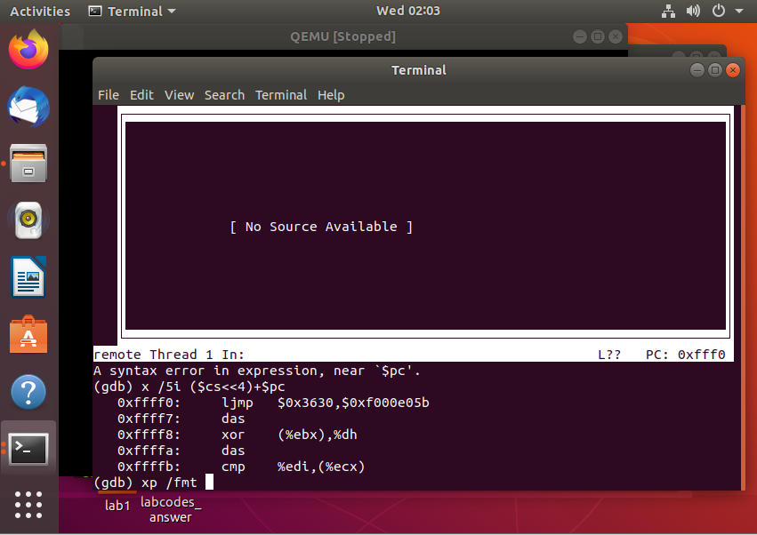
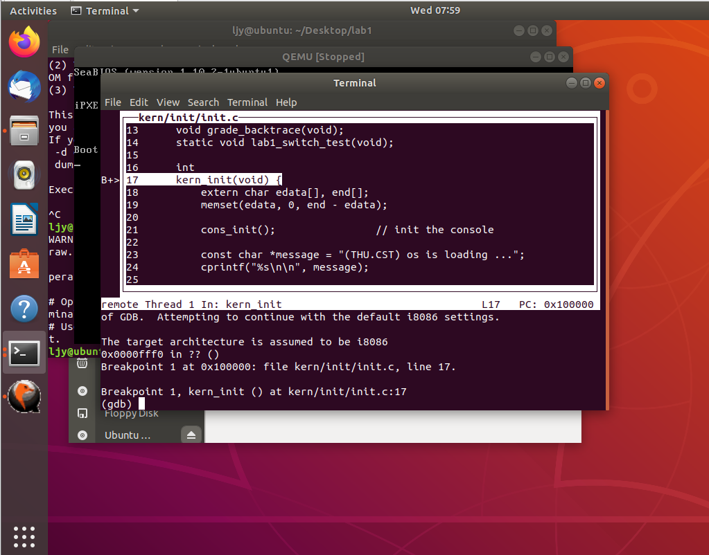

#  lab1-练习二

> 使用qemu执行并调试lab1中的软件。

##   问题一

> 单步跟踪BIOS的执行

为了使用gdb调试qemu上运行的程序，我们需要首先适当修改gdb初始化配置文件gdbinit文件

```assembly
set architecture i8086
target remote :1234
#意为每次暂停就执行一次下方 x /i ($cs<<4)+pc 语句
#实际指令地址是由$pc和$cs计算得到的($cs*16+$pc)
define hook-stop
x /i ($cs<<4)+pc
end
```

执行`make debug` 来到gbd调试界面然后使用`si`指令来单步执行即可



第一次尝试单步调试并显示指令信息时，我直接使用了gdb的`x /i $pc`指令，但是随后的实验中我发现所显示的地址和指令并不符合实际情况，如下图，地址并未从0x7c00跳转到0xe05b（实际上$pc当然也不会跳转到0xe05b）,显示内容和bootasm.S文件进行比对，发现指令也是不相符的。随后进一步了解到此处x 指令的参数应该是虚拟地址，虚拟地址=$cs*16+$pc




## 问题二

>  在初始化位置0x7c00开始跟踪代码运行，将单步跟踪反汇编的带的代码与bootasm.S和bootblock.asm进行比较。

照例修改gdb初始化配置文件gdbinit文件

```assembly
#使用i8086来作为qemu芯片
set architecture i8086
#设置端口1234连接gdb
target remote :1234
#每次stop就执行下方define和end之间的语句
define hook-stop
#实际指令地址是由$pc和$cs计算得到的($cs*16+$pc)
x /i ($cs<<4)+pc
end
#在0x7c00处设置断点
b *0x7c00
continue
```

执行结果如下图，和bootasm.S和bootblock.asm对比，指令是相同的






指导书提供了另外一种方法，修改makefile里qemu的配置选项使用qemu生成的log文件来查看代码运行的汇编代码。

结果如下，指令也是相同的



遇到的坑：gdbinit文件中键入`b*0x7c00`后忘记了continue，导致指令未能正确执行（地址未进行跳转）。



## 问题三·

> 自己设置断点并进行测试

修改gdbinit文件（将原始文件的断点b* 0x7c00修改即可）

此处我将它修改为函数kern_init处。

```asm
file bin/kernel
target remote :1234
break kern_init
continue
```

进入的调试界面如下：



前面我们发现使用`si`(`stepi`)可以实现跟踪且进入步进执行汇编指令，使用`s`(`step`)指令可以实现跟踪且进入步进执行C代码，`n`(`next`)指令只跟踪不进入的步进C代码，`ni`（`nexti`）同理。


