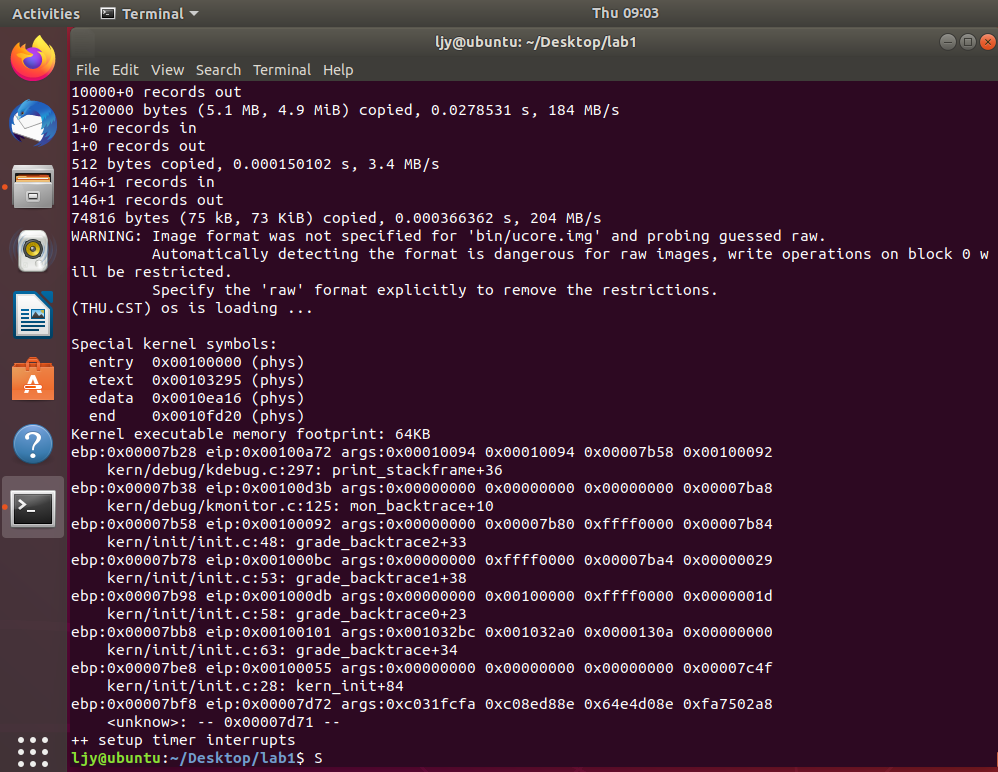

#  练习五

> 我们需要在lab1中完成对debug.c中函数print_stackframe的实现，可以通过函数print_stackframe来跟踪函数调用堆栈中记录的返回地址。

首先，要明白函数调用中栈的详细情况。

> 内联函数
>
> 在编译阶段，将内联函数的代码拷贝到当前地址，不需要函数地址的转移以及压栈出栈等操作。
>

根据注释，得出函数print_stackframe（）代码如下


```c

uint32_t *ebp = 0; //定义为指针，方便访问
uint32_t esp = 0;
//查看文件发现read_ebp()和read_eip()都是inline内联函数
//这里read_ebp必须定义为inline函数
 ebp = (uint32_t *)read_ebp();
//read_esp函数则不能定义为内联函数，调用read_eip时会把当前指令的下一条指令的地址
//（也就是eip寄存器的值）压栈，那么在进入read_eip函数内部后便可以从栈中获取到调用前eip寄存器值。
 esp = read_eip();

 while (ebp) //循环执行下列语句直到ebp为0
 {
     cprintf("ebp:0x%08x eip:0x%08x args:", (uint32_t)ebp, esp);
     cprintf("0x%08x 0x%08x 0x%08x 0x%08x\n", ebp[2], ebp[3], ebp[4], ebp[5]);
	//分别是第一、第二、第三、第四个参数
     print_debuginfo(esp - 1); //打印当前指令信息

     esp = ebp[1]; //函数返回地址
     ebp = (uint32_t *)*ebp;
 }
  /* LAB1 YOUR CODE : STEP 1 */
  /* (1) call read_ebp() to get the value of ebp. the type is (uint32_t);
   * (2) call read_eip() to get the value of eip. the type is (uint32_t);
   * (3) from 0 .. STACKFRAME_DEPTH
   *    (3.1) printf value of ebp, eip
   *    (3.2) (uint32_t)calling arguments [0..4] = the contents in address (uint32_t)ebp +2 [0..4]
   *    (3.3) cprintf("\n");
   *    (3.4) call print_debuginfo(eip-1) to print the C calling function name and line number, etc.
   *    (3.5) popup a calling stackframe
   *           NOTICE: the calling funciton's return addr eip  = ss:[ebp+4]
   *                   the calling funciton's ebp = ss:[ebp]
   */
}                     
```

`make qemu`得到结果如下图



所打印信息与实验指导书中信息一致。

